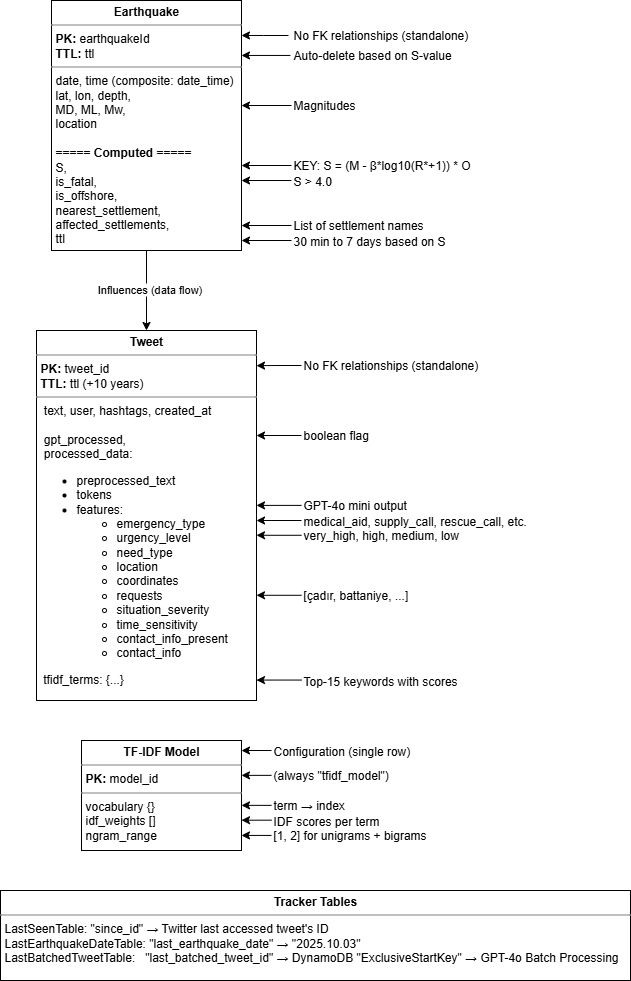

# SeismIQ


## 🧭 Table of Contents

- [💡 Overview](#-overview)
- [🎯 Features](#-features)
- [🏗️ Design Documents (C4 Model)](#%EF%B8%8F-design-documents-c4-model)
- [📊 ML Performance Metrics](#-ml-performance-metrics)
- [⚙️ Technology Stack](#%EF%B8%8F-technology-stack)
    - [Frontend](#frontend)
    - [Backend (Microservices)](#backend-microservices)
    - [AI Intelligence](#ai-intelligence)
    - [Data Storage](#data-storage)
    - [Infrastructure](#infrastructure)
    - [External Services](#external-services)
    - [Development Tools](#development-tools)
    - [Key Features](#key-features)
- [📂 Project Structure](#-project-structure)
- [📱 Application Flow](#-app-launch--authentication-flow)
    - [Step 1: Application Entry](#-step-1-application-entry)
    - [Step 2: Main Interface](#-step-2-main-interface)
    - [Step 3: Interactive Map Experience](#-step-3-map-visualization-flow)
    - [Step 4: Emergency Reporting Workflow](#-step-4-report-submission-flow)
    - [Step 5: Landmark Management System](#-step-5-landmark-creation-flow)
    - [Step 6: Push Notification Flow](#-step-6-push-notification-flow)
    - [Step 7: Real-time Data Management](#step-7-real-time-data-management)
    - [Step 8: AI Integration Workflow](#step-8-ai-integration-workflow)
    - [Step 9: Session & Security Flow](#-step-9-session--security-flow)
- [🌐 API Endpoints](#-api-endpoints)
    - [Authentication](#authentication)
    - [User Management](#user-management)
    - [Earthquake Data](#earthquake-data)
    - [Reports Management](#reports-management)
    - [Landmarks Management](#landmarks-management)
    - [Authentication Notes](#-authentication-notes)
    - [Special Features](#-special-features)
- [🧩 Architectural Decision Records (ADRs)](#-architectural-decision-records-adrs)
    - [ADR-1: Serverless Architecture (AWS Lambda)](#adr-1-serverless-architecture-aws-lambda)
    - [ADR-2: Kandilli Seismological Engine (S-value)](#adr-2-kandilli-seismological-engine-s-value-calculation)
    - [ADR-3: Two-Stage Tweet Processing](#adr-3-two-stage-tweet-processing-real-time--batch)
    - [ADR-4: DynamoDB with TTL](#adr-4-dynamodb-with-ttl)
    - [ADR-5: Turkish NLP Pipeline](#adr-5-turkish-nlp-pipeline-zemberek--spacy--gpt-4o-mini)
- [📜 License](#-license)
- [❤️ Acknowledgments](#%EF%B8%8F-acknowledgments)

## 💡 Overview

Natural disasters like earthquakes can strike without warning, leaving cities and communities in urgent need of coordination, communication, and resource distribution. In such chaotic environments, time is critical. Rescue operations, humanitarian aid, and survivor outreach efforts must be fast, efficient, and based on accurate, real-time information. Unfortunately, traditional communication infrastructures often collapse or become overloaded, creating serious gaps in coordination.

This project was created as a response to that challenge — a mobile-first, cloud-powered platform designed to facilitate disaster relief through crowd participation and intelligent data processing.

SeismIQ provides a centralized system where individuals affected by the disaster, as well as volunteers and responders, can report:

-What kind of help they need (e.g., medical aid, food, water, shelter)

-What resources they can offer (e.g., crane availability, first aid kits, mobile kitchens)

-Where they are located, using GPS and map integration

These reports are immediately visualized on an interactive map to help relief organizations and other users gain situational awareness and act accordingly.

Beyond manual reporting, the system integrates optional machine learning capabilities to process Twitter data and detect urgent calls for help. Tweets containing keywords like “under rubble”, “need food”, or “stuck in debris” are automatically analyzed using Natural Language Processing (NLP) models and then geolocated and classified. This enables the system to pick up signals even when users can’t access the app directly — increasing visibility of unseen crises.

The backend is fully built on Amazon Web Services (AWS) using a serverless architecture. AWS Lambda, DynamoDB, API Gateway; power the backend logic, data storage, and AI model inference. This approach ensures high scalability and low latency, even under sudden traffic surges during a disaster scenario.

The mobile app, developed using Android Studio in Java, is designed to be intuitive and lightweight, requiring minimal input while offering life-saving functionality. The UI is focused on ease of use in high-stress environments, with map-based reporting, quick taps for emergency types, and push notification support for nearby alerts.

In summary, this project aims to:

-Empower citizens to self-report and assist others during a disaster

-Support first responders with real-time spatial data on needs and resources

-Leverage AI and social media to amplify voices that may not otherwise be heard

-Provide a scalable, modular, and cloud-native architecture for humanitarian applications

---

## **🎯 Features**

- 📍 Location-based help/resource reporting
- 🧠 Tweet analysis and seismiq monitoring for detecting emergency requests (via NLP)
- 🔔 Push notifications for critical alerts
- 🗺️ Resource visualization: cranes, food spots, shelters, etc.
- 🧩 Modular backend using AWS Lambda & API Gateway
- 📲 Android mobile app with interactive maps and reporting

---

## 🏗️ Design Documents (C4 Model)

### System Context Diagram


### Container Diagram


### Deployment Diagram


### Component Diagrams


### Data Model Essentials


### Twitter Pipeline Components


### Kandilli Engine Components


### Sequence Diagrams

.png)


---

## 📊 ML Performance Metrics

This section details the performance of the Natural Language Processing (NLP) pipeline, which automatically classifies tweets and social media data into distinct emergency categories.

### Classification Accuracy (Table 3.0 & 3.1)

#### Table 3.0: Confusion Matrix
Showing the distribution of predicted versus actual emergency classifications across all categories.

| Predicted/Actual | Medical | Supply | Rescue | Danger | None | Total |
|:-----------------|:--------|:-------|:-------|:-------|:-----|:------|
| **medical_aid** | 14 | 1 | 0 | 0 | 0 | 15 |
| **supply_call** | 1 | 23 | 1 | 0 | 0 | 26 |
| **rescue_call** | 1 | 2 | 173 | 11 | 6 | 193 |
| **danger_notice** | 0 | 0 | 0 | 15 | 1 | 16 |
| **none** | 8 | 6 | 3 | 9 | 224 | 250 |
| **Total** | 23 | 33 | 180 | 33 | 231 | 500 |

#### Table 3.1: Classification Report
Showing precision, recall, F1-score, and support for each emergency category, along with macro and weighted averages.

| Class | Precision | Recall | F1 | Support |
|:---|:---|:---|:---|:---|
| **medical_aid** | 0.609 | 0.933 | 0.737 | 15 |
| **supply_call** | 0.697 | 0.885 | 0.781 | 26 |
| **rescue_call** | 0.961 | 0.896 | 0.927 | 193 |
| **danger_notice** | 0.455 | 0.938 | 0.608 | 16 |
| **none** | 0.970 | 0.896 | 0.932 | 250 |
| **Macro Avg** | **0.738** | **0.910** | **0.797** | **500** |
| **Weighted Avg** | **0.925** | **0.898** | **0.906** | **500** |

### Key Observations

- **High Precision for Non-Emergency:** The model exhibits a **high precision for `none` (97.0%)**, which is crucial as it **minimizes false alarms** for first responders.
- **High Recall for Critical Cases:** The high recall for **`danger_notice` (93.8%)** ensures that critical emergencies and immediate hazards are rarely missed (low False Negative Rate).
- **Reliable Rescue Identification:** The **`rescue_call`** category shows strong balanced performance (**96.1% Precision / 89.6% Recall**), reliably identifying urgent trapped-person cases.
- **Recall Priority:** Categories like `medical_aid` and `supply_call` have moderate precision (60.9% / 69.7%) but **high recall** (93.3% / 88.5%), indicating the system prioritizes *catching* an emergency signal over occasionally mislabeling it—an acceptable trade-off for disaster response.

### Error Analysis

Most errors occur between semantically similar classes (`rescue` ↔ `danger`) and at the boundary between emergency and non-emergency content (`none` ↔ `other categories`), reflecting the inherent ambiguity in real-world social media text.

**Most Common Misclassifications (62 total errors):**

- **`rescue_call` → `danger_notice` (11 tweets, 18%):**
    *Example:* "People trapped under debris" is often misclassified as a generalized danger notice instead of a specific call for rescue.
- **`none` → `danger_notice` (9 tweets, 15%):**
    *Example:* "Collapsed building nearby" may be flagged as a general danger notice even if the tweet isn't explicitly seeking help.
- **`none` → `medical_aid` (8 tweets, 13%):**
    *Example:* "Visited hospital for checkup" is a non-emergency that sometimes gets flagged as medical need.
- **`rescue_call` → `none` (6 tweets, 10%):**
    *Example:* "Rescue team on site" tweets, which report on the resolution of a rescue, are sometimes incorrectly flagged as `none`.
- **`supply_call` → `medical_aid` (1 tweet, 2%):**
    *Example:* "Need bandages" confused with medical emergency.
- **Other combinations (27 tweets, 43%)**

**Critical Metrics for Disaster Response:**

- **Zero `rescue_call` misclassified as `none`** (No missed life-threatening situations).
- **Only 1 `danger_notice` missed** (93.8% sensitivity for hazards).
- **False Negative Rate for all emergency categories is low at 2.4%**, demonstrating the model's fitness for rapid, life-saving information extraction.

---

## ⚙️ Technology Stack

### **Frontend**
| Component | Technology | Purpose |
|------------|-------------|----------|
| Platform | Android SDK 30+ | Mobile app |
| Language | Java 11 | Native development |
| UI Framework | Material Design, AndroidX | User interface |
| Maps | Google Maps SDK | Location visualization |
| HTTP Client | Retrofit 2.9 | API calls |
| JSON | Gson | Serialization |
| Auth | JWT in SharedPreferences | Token storage |

---

### **Backend (Microservices)**
| Component | Technology | Purpose |
|------------|-------------|----------|
| Runtime | AWS Lambda (Java 21) | Serverless compute |
| Build Tool | Maven 3.9 | Dependency management |
| Framework | AWS Lambda Java Events | Request handling |
| JSON | Gson 2.10 | Serialization |
| Database Access | AWS SDK for DynamoDB | Data operations |

---

### **AI Intelligence**
| Component | Technology | Purpose |
|------------|-------------|----------|
| Runtime | AWS Lambda (Python 3.11) | Serverless compute |
| Web Scraping | BeautifulSoup | Kandilli data extraction |
| X API | X API v2 | Tweet collection |
| Turkish NLP | Zemberek (via JPype) | Normalization / Lemmatization |
| Tokenization | SpaCy | NER, tokenization |
| Feature Extraction | Scikit-learn 1.3 (TF-IDF) | Keyword extraction |
| LLM | OpenAI GPT-4o mini | Emergency classification |
| Geospatial | GeoPandas, Shapely | Spatial analysis |
| ML | Scikit-learn (BallTree) | Nearest neighbor queries |

---

### **Data Storage**
| Component | Technology | Purpose |
|------------|-------------|----------|
| Database | AWS DynamoDB | NoSQL data store |
| Tables | 7 tables | Users, Reports, Landmarks, Earthquakes, Tweets, etc. |
| Billing | Pay-per-request | Auto-scaling |
| TTL | Native DynamoDB TTL | Auto-delete old data |
| Geospatial Data | AWS S3 | Cities5000.parquet, land.geojson, GMPE coefficients |

---

### **Infrastructure**
| Component | Technology | Purpose |
|------------|-------------|----------|
| API Gateway | AWS API Gateway (REST) | Route HTTP requests |
| Authentication | AWS Cognito User Pool | User management, JWT |
| Logging | AWS CloudWatch Logs | Lambda logs |
| Monitoring | AWS CloudWatch Metrics | Performance tracking |
| Scheduling | CloudWatch Events | Trigger Lambdas (10 min) |
| IaC | AWS SAM (templates.yaml) | Infrastructure as Code |

---

### **External Services**
| Service | Purpose | Protocol |
|----------|----------|-----------|
| Kandilli Observatory | Real-time earthquake data | HTTP / Web scraping |
| X (Twitter) API | Social media monitoring | OAuth 1.0 / REST |
| OpenAI GPT-4o API | Text classification | REST / HTTPS |
| Google Maps API | Map rendering, geocoding, visualization | REST / HTTPS |

---

### **Development Tools**
| Tool | Purpose |
|------|----------|
| Android Studio | Mobile app development |
| IntelliJ IDEA / VS Code | Backend development |
| Jupyter Notebook | ML experimentation |
| Maven | Java build |
| Gradle | Android build |
| Git | Version control |
| Postman | API testing |

---

### **Key Features**

- **Serverless:** All Lambda functions auto-scale dynamically (0 → 1000s).  
- **TTL:** Automatic deletion for old data:  
  - Earthquakes: *30 minutes – 7 days* (based on S-value)  
  - Tweets: *10 years*  
- **Scheduled Tasks:**  
  - Kandilli Engine runs every **10 minutes**  
  - Twitter Pipeline runs every **10 minutes**  
- **Security:** Cognito Authorizer + IAM Least Privilege Access  
- **Region:** `us-east-1`

---

## **📂 Project Structure**

```bash
SeismIQ/
├── seismiq-backend/           # AWS Serverless Backend
│   ├── common-lib/           # Shared models and utilities
│   │   ├── src/main/java/com/seismiq/common/
│   │   │   ├── model/        # Data models (User, Report, Landmark, Earthquake)
│   │   │   └── service/      # Shared services (NotificationService)
│   │   └── pom.xml
│   ├── earthquake-service/   # Earthquake data management
│   │   ├── src/main/java/
│   │   └── pom.xml
│   ├── report-service/       # Emergency report handling
│   │   ├── src/main/java/
│   │   └── pom.xml
│   ├── landmark-service/     # Resource location management
│   │   ├── src/main/java/
│   │   └── pom.xml
│   ├── user-service/         # User profile management
│   │   ├── src/main/java/
│   │   └── pom.xml
│   ├── infrastructure/       # CloudFormation templates
│   │   └── templates.yaml
│   └── pom.xml              # Parent POM configuration
├── seismiq-frontend/         # Android Mobile Application
│   ├── app/
│   │   ├── src/main/java/com/seismiq/app/
│   │   │   ├── api/         # Retrofit API interfaces
│   │   │   ├── auth/        # AWS Cognito authentication
│   │   │   ├── model/       # Data models
│   │   │   ├── services/    # FCM messaging service
│   │   │   ├── ui/          # Activities and fragments
│   │   │   │   ├── auth/    # Login/Register activities
│   │   │   │   ├── fragments/ # Map, Report, Landmark fragments
│   │   │   │   └── map/     # Map-specific UI components
│   │   │   ├── utils/       # Utility classes
│   │   │   └── MainActivity.java
│   │   ├── src/main/res/    # Android resources
│   │   ├── google-services.json # Firebase configuration
│   │   └── build.gradle     # App build configuration
│   ├── gradle/              # Gradle wrapper
│   └── build.gradle         # Project build configuration
├── twitter/                  # AI/NLP Tweet Analysis Pipeline
│   ├── Aug10_scraper.py     # Twitter data scraping
│   ├── Aug10_tweet_analysis.ipynb # Data analysis notebooks
│   ├── Feb6_tweet_analysis.ipynb
│   ├── Tweet_preprocessingv2.py # NLP preprocessing
│   ├── kandilli_scrape.py   # Earthquake data integration
│   ├── generate_mock_data.py # Test data generation
│   └── geojson_converting.py # Geographic data processing
├── Metrics/                  # Analytics and performance data
│   ├── Aug10_1500_tweets.docx
│   ├── Aug10_tweet_analysis.docx
│   └── Feb6_tweet_analysis.docx
├── api-templates/           # API documentation templates
├── docs/                    # Project documentation
│   ├── README.md           # Main project documentation
│   ├── ROADMAP.md          # Application flow roadmap (this file)
│   └── API_ENDPOINTS.md    # Backend API documentation
├── postman-collection.json # API testing collection
├── requirements.txt        # Python dependencies
├── start_seismiq.sh       # Deployment script
└── LICENSE                # MIT License
```

---

## 📱 App Launch & Authentication Flow

### 🔐 Step 1: Application Entry
```
App Launch (LoginActivity)
    ↓
Check Authentication Status
    ↓
├─ User Logged In → Navigate to MainActivity
└─ User Not Logged In → Show Login Screen
```

#### **Login Screen Features:**
- ✅ Username/Email input
- ✅ Password input  
- ✅ Login button with progress indicator
- ✅ "Register" link for new users
- ✅ Auto-login check on app start

#### **Registration Flow:**
```
Login Screen → "Register" link
    ↓
Registration Screen (RegisterActivity)
    ↓
User Information Collection:
├─ Username & Email
├─ Password & Name
├─ Address/Location
├─ Volunteer Checkbox
└─ Social Worker Checkbox
    ↓
AWS Cognito Registration
    ↓
├─ Success → Backend User Creation → MainActivity
└─ Email Verification Required → Back to Login
```

---

## 🏠 Main Application Flow

### 🎯 Step 2: Main Interface
```
Successful Login
    ↓
MainActivity with Bottom Navigation
    ↓
┌─ 🏠 Home/Dashboard
├─ 🗺️ Interactive Map  
├─ 📝 Report Emergency
├─ 📍 Add Landmark
└─ ⚙️ Settings/Profile
```

#### **Navigation Features:**
- ✅ Bottom navigation bar with 5 main sections
- ✅ Material Design toolbar
- ✅ Firebase Cloud Messaging initialization
- ✅ Notification intent handling
- ✅ Navigation controller setup

---

## 🗺️ Interactive Map Experience

### 📍 Step 3: Map Visualization Flow
```
Map Tab Selection
    ↓
MapFragment Initialization
    ↓
Google Maps Loading
    ↓
Data Loading Process:
├─ Authentication Token Retrieval
├─ Earthquake Data API Call
├─ Reports Data API Call
└─ Real-time Map Updates
    ↓
Interactive Map Features:
├─ Earthquake Markers
├─ Emergency Report Markers
└─ Location-based Clustering
```

#### **Map Interaction Features:**
- ✅ **Real-time Data**: Live earthquake and report visualization
- ✅ **Interactive Markers**: Tap for detailed information
- ✅ **Heatmap View**: Emergency density visualization
- ✅ **Multi-layer Toggle**: Earthquakes, Reports, All data
- ✅ **Location Focus**: Turkey-centered with zoom controls
- ✅ **Info Windows**: Detailed popup information

#### **Alternative Map View (Toggle Options):**
```
Map Interface
    ↓
Toggle Button Group:
├─  Earthquakes Only
├─  Landmarks Only  
└─  All Data Combined
    ↓
Dynamic Marker Management
└─ Real-time Layer Switching
```

---

## 🚨 Emergency Reporting Workflow

### 📝 Step 4: Report Submission Flow
```
Report Tab Selection
    ↓
ReportFragment Interface
    ↓
Emergency Category Selection:
├─ Medical Help
├─ Shelter Needed
├─ Food/Water
├─ Infrastructure Damage
└─ Heavy Equipment (Crane)
    ↓
Location Services:
├─ GPS Auto-Detection
├─ Manual Location Entry
└─ Address Input
    ↓
Report Details:
├─ Description Text
├─ Severity Level
└─ Contact Information
    ↓
Submission Process:
├─ Authentication Check
├─ API Submission
├─ Backend Processing
└─ Confirmation/Error Handling
```

#### **Report Features:**
- ✅ **Category Selection**: Spinner with predefined emergency types
- ✅ **GPS Integration**: Automatic location detection with permission handling
- ✅ **Manual Location**: Text input for address/description
- ✅ **Real-time Submission**: Immediate API integration
- ✅ **Progress Indicators**: Loading states and error handling
- ✅ **Validation**: Required field checking before submission

---

## 🏛️ Landmark Management System

### 📍 Step 5: Landmark Creation Flow
```
Landmark Tab Selection
    ↓
LandmarkPostFragment Interface
    ↓
Interactive Map Selection:
└─ Tap to Place Landmark
    ↓
Landmark Information:
├─ Name/Title
├─ Description
├─ Category Type:
│   ├─ Medical Facility
│   ├─ Shelter/Safe Zone
│   ├─ Food Distribution
│   ├─ Water Source
│   └─ Equipment/Resources
├─ Contact Information
└─ Availability Status
    ↓
Submission & Notification:
├─ API Submission
├─ Backend Processing
├─ Nearby User Notification
└─ Map Integration
```

#### **Landmark Features:**
- ✅ **Interactive Placement**: Tap-to-place on Google Maps
- ✅ **Category System**: Organized resource types
- ✅ **Proximity Notifications**: Alert nearby users via FCM
- ✅ **Real-time Updates**: Immediate map integration
- ✅ **Validation**: Required information checking

---

## 🔔 Notification System Workflow

### 📲 Step 6: Push Notification Flow
```
Landmark Creation
    ↓
Backend Processing:
├─ Location Analysis
├─ User Proximity Calculation (10km radius)
└─ Notification Trigger
    ↓
Firebase Cloud Messaging:
├─ Message Composition
├─ Device Token Resolution
└─ Push Delivery
    ↓
User Device:
├─ Notification Reception
├─ Tap to Open App
├─ Navigation to Map
└─ Focus on Landmark Location
```

#### **Notification Features:**
- ✅ **Location-based**: 10km radius proximity alerts
- ✅ **Rich Content**: Landmark details and location
- ✅ **Deep Linking**: Direct navigation to map location
- ✅ **Background Processing**: Works when app is closed
- ✅ **Token Management**: Automatic device registration

---

##  Data Synchronization Flow

### Step 7: Real-time Data Management
```
App Activity
    ↓
Continuous Data Flow:
├─ Authentication Token Refresh
├─ Location Service Updates
├─ API Data Synchronization:
│   ├─ Earthquake Data (KANDILLI Integration)
│   ├─ User Reports (Real-time)
│   ├─ Landmark Updates
│   └─ User Profile Sync
├─ Firebase Token Updates
└─ Background Sync Services
    ↓
UI Updates:
├─ Map Marker Refresh
├─ Report Status Updates  
├─ Notification Badge Updates
└─ Real-time Data Visualization
```

#### **Data Management Features:**
- ✅ **Real-time Sync**: Continuous data updates
- ✅ **Offline Resilience**: Error handling and retry logic
- ✅ **Token Management**: Automatic authentication refresh
- ✅ **Background Services**: Data sync when app is minimized
- ✅ **State Management**: Persistent user preferences

---

## Background Intelligence Flow

### Step 8: AI Integration Workflow
```
Twitter/Social Media Monitoring
    ↓
NLP Processing Pipeline:
├─ Turkish Language Detection
├─ Emergency Keyword Analysis
├─ Location Extraction
├─ Urgency Classification
└─ Sentiment Analysis
    ↓
Automated Report Generation:
├─ Geo-location Assignment
├─ Category Classification
├─ Priority Scoring
└─ Map Integration
    ↓
Emergency Response:
├─ High-priority Alert Generation
├─ Emergency Services Notification
└─ Public Awareness Updates
```

#### **AI Features:**
- ✅ **Turkish NLP**: Native language emergency detection
- ✅ **Social Media Integration**: Twitter emergency monitoring
- ✅ **Automated Classification**: Emergency type recognition
- ✅ **Geolocation Services**: Address to coordinate conversion
- ✅ **Priority Assessment**: Urgency-based alert system

---

## User Session Management

### 🔐 Step 9: Session & Security Flow
```
Active User Session
    ↓
Security Measures:
├─ JWT Token Validation
├─ AWS Cognito Integration
├─ Automatic Session Refresh
└─ Secure API Communication
    ↓
Session Activities:
├─ Report Submission Tracking
├─ Location History (Privacy-Aware)
├─ Notification Preferences
└─ User Activity Logging
    ↓
Session End:
├─ Secure Logout Process
├─ Token Invalidation
├─ Local Data Cleanup
└─ Notification Unsubscription
```

#### **Security Features:**
- ✅ **AWS Cognito**: Enterprise-grade authentication
- ✅ **JWT Tokens**: Secure API communication
- ✅ **Session Management**: Automatic refresh and validation
- ✅ **Privacy Protection**: Location data encryption
- ✅ **Secure Logout**: Complete session cleanup

---

## 🌐 API Endpoints

### Authentication
| Method | Endpoint            | Description                           | Auth Required |
|--------|---------------------|---------------------------------------|---------------|
| POST   | `/users`            | Register a new user                   | ❌            |
| POST   | `/users/login`      | User login                           | ❌            |

### User Management
| Method | Endpoint            | Description                           | Auth Required |
|--------|---------------------|---------------------------------------|---------------|
| GET    | `/users/{userId}`   | Get user profile                     | ✅            |
| PUT    | `/users/{userId}`   | Update user profile (includes FCM token) | ✅        |
| DELETE | `/users/{userId}`   | Delete user account                  | ✅            |

### Earthquake Data
| Method | Endpoint                  | Description                         | Auth Required |
|--------|---------------------------|-------------------------------------|---------------|
| GET    | `/earthquakes`            | List all earthquakes               | ✅            |
| POST   | `/earthquakes`            | Create new earthquake record       | ✅            |
| GET    | `/earthquakes/{earthquakeId}` | Get specific earthquake        | ✅            |
| GET    | `/earthquakes/location`   | Get earthquakes by location        | ✅            |

### Reports Management
| Method | Endpoint                     | Description                         | Auth Required |
|--------|------------------------------|-------------------------------------|---------------|
| GET    | `/reports`                   | List all user-submitted reports     | ✅            |
| POST   | `/reports`                   | Submit a new report                 | ✅            |
| GET    | `/reports/{reportId}`        | Get specific report details         | ✅            |
| PUT    | `/reports/{reportId}`        | Update report                       | ✅            |
| DELETE | `/reports/{reportId}`        | Delete report                       | ✅            |
| PUT    | `/reports/{reportId}/status` | Update report status                | ✅            |
| PUT    | `/reports/{reportId}/location` | Update report location            | ✅            |
| GET    | `/users/{userId}/reports`    | Get reports by specific user        | ✅            |
| GET    | `/reports/category/{category}` | Get reports by category           | ✅            |
| GET    | `/reports/status/{status}`   | Get reports by status               | ✅            |

### Landmarks Management
| Method | Endpoint                | Description                           | Auth Required |
|--------|-------------------------|---------------------------------------|---------------|
| GET    | `/landmarks`            | List all landmarks                    | ✅            |
| POST   | `/landmarks`            | Create new landmark (triggers notifications) | ✅    |
| GET    | `/landmarks/{landmarkId}` | Get specific landmark details       | ✅            |
| PUT    | `/landmarks/{landmarkId}` | Update landmark                     | ✅            |
| DELETE | `/landmarks/{landmarkId}` | Delete landmark                     | ✅            |

### 🔐 Authentication Notes
- **Auth Required (✅)**: Endpoints require AWS Cognito JWT token in Authorization header
- **No Auth (❌)**: Public endpoints for registration and login
- **Base URL**: `https://{api-gateway-id}.execute-api.eu-north-1.amazonaws.com/Prod/`

### 📱 Special Features
- **FCM Integration**: PUT `/users/{userId}` supports updating Firebase device tokens for push notifications
- **Location-Based**: Landmarks creation automatically triggers notifications to nearby users
- **Real-time Updates**: Earthquake and report data updates are streamed through DynamoDB
- **Geospatial Queries**: Location-based filtering for earthquakes and landmarks

> 🔐 JWT or Firebase token required for protected endpoints

---

## 🧩 Architectural Decision Records (ADRs)  

---

### **ADR-1: Serverless Architecture (AWS Lambda)**  
**Decision:** Use AWS Lambda instead of EC2 or containerized servers.  

**Why:**  
- Disasters create unpredictable 10×–100× traffic spikes.  
- Pay only for actual compute usage — no cost for idle time.  
- Auto-scales from 0 to thousands of concurrent executions.  
- No manual server management during emergencies.  

**Trade-off:**  
- Cold start latency (≈50–500 ms) vs always-on servers.  
- Accepted because *millisecond-level latency is not critical for disaster response.*  

---

### **ADR-2: Kandilli Seismological Engine (S-value Calculation)**  
**Decision:** Use **AC10 GMPE formula** instead of simple magnitude to calculate earthquake impact.  

**Why:**  
- Scientifically optimized for Turkey’s geological context.  
- Considers **magnitude**, **depth**, **distance**, and **offshore status**.  
- Enables targeted Twitter queries — *5× efficiency improvement.*  
- Automatically expires low-risk earthquakes using TTL.  

**Formula:**  
\[
S = (M - β(M) * \log_{10}(R^* + 1)) * O
\]

**Impact:**  
- Focuses Twitter scraping only on **high-risk settlements**.  
- Saves ~80% of Twitter API quota.  

---

### **ADR-3: Two-Stage Tweet Processing (Real-time + Batch)**  
**Decision:** Process tweets in **two stages** instead of purely real-time.  

**Stage 1 (Real-time, < 1 s):** Clean + TF-IDF → Immediately searchable  
**Stage 2 (Batch, ≈ 4 min):** GPT-4 → Structured feature extraction  

**Why:**  
- Emergency coordinators require **instant keyword visibility**.  
- GPT-4 API cost is high for per-tweet processing.  
- Batch mode reduces cost by **~90%** and avoids rate limits.  

**Result:**  
- Tweets visible in **< 1 minute** for search.  
- Full semantic intelligence within **~10 minutes**.  

---

### **ADR-4: DynamoDB with TTL**  
**Decision:** Use **DynamoDB** instead of RDS, leveraging automatic TTL.  

**Why:**  
- Auto-scales read/write throughput during sudden traffic surges.  
- Pay-per-request billing minimizes idle cost.  
- TTL automatically deletes:  
  - Earthquakes → *30 min – 7 days (S-based)*  
  - Tweets → *10 years*  
- No manual cleanup or maintenance needed.  

**Trade-off:**  
- No complex SQL joins (compared to relational DBs).  
- Accepted since SeismIQ queries are simple (by **PK/GSI**).  

---

### **ADR-5: Turkish NLP Pipeline (Zemberek + SpaCy + GPT-4o mini)**  
**Decision:** Combine **three NLP tools** for robust Turkish text processing.  

**Why:**  
- Turkish is an **agglutinative language** with complex morphology.  
- **Zemberek:** Advanced Turkish lemmatization and normalization.  
- **SpaCy:** Fast tokenization + Named-Entity Recognition (NER).  
- **GPT-4o mini:** Contextual classification and semantic interpretation.  

**Pipeline:**  
`Clean → Zemberek → SpaCy → TF-IDF → GPT-4o mini`  

**Result:**  
- High linguistic accuracy for Turkish emergency-related text.  
- Strong resilience against noise, slang, and informal phrasing.  

---

## 📜 License

This project is licensed under the **MIT License**.

---

## ❤️ Acknowledgments

Special thanks to the **AWS Student Engagement Program**and our mentors Utku Yavus and Elisa Ronga for their support and help throughout this program. As well as speacial thanks and congratulations to all team members (Sıla Bozkurt, Salih Mert Uzun, Berksu Tekkaya) who contributed to this project. SeismIQ is built with the belief that **rapid, decentralized, and citizen-powered disaster response** can save lives.

---
